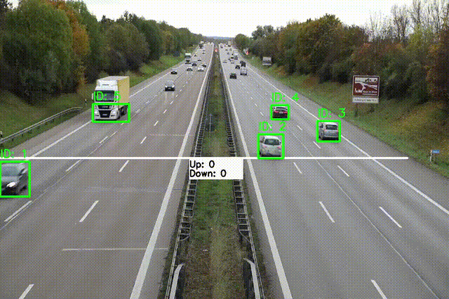

# Car Tracking and Counting Project

## Overview

This project focuses on tracking cars in a video and counting their movements in two directions: up and down. The goal is to preprocess a video to identify cars and determine their direction of movement. This is accomplished using a YOLOv5 model for object detection combined with a SORT tracker for tracking.

## Project Components

1. **YOLOv5 for Car Detection**: A state-of-the-art object detection model used to identify cars in each frame of the video.
2. **SORT Tracker**: An efficient tracking algorithm used to maintain the identity of each car across frames and detect their movement direction.

## How It Works

1. **Input Video**: The original video is processed to detect and track cars.
2. **Preprocessing**: The video is analyzed to identify car movements. Cars are tracked to determine if they are moving up or down.
3. **Output Video**: The results are displayed in a processed video, highlighting the direction of each car's movement.

## GIF Examples

Below are two GIFs showing the original and processed videos:

### Original Video

This GIF represents the video without any preprocessing:


### Processed Video


This GIF shows the video after applying preprocessing, with cars tracked and their movements indicated:



## Requirements

- **Python 3.x**
- **PyTorch**: For running YOLOv5 and other neural network models.
- **OpenCV**: For video processing and visualization.

## Installation

To set up the project environment, follow these steps:

1. Clone the repository:
    ```bash
    git clone https://github.com/ahmedghida/CarCount.git
    cd car-tracking-counting
    ```

2. Install the required packages:
    ```bash
    pip install -r requirements.txt
    ```

3. Ensure you have YOLOv5 and SORT tracker set up as described in their respective documentation.

    For Sort Tracker
    
    ```bash
    git clone https://github.com/abewley/sort.git
    cd sort
    pip install -r requirements.txt
    ```

